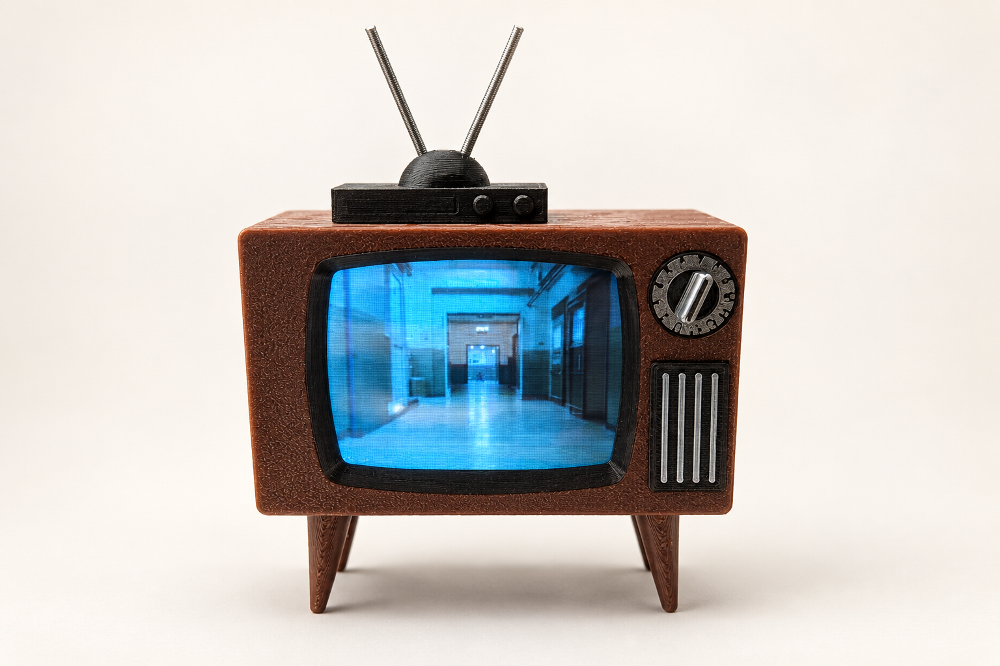
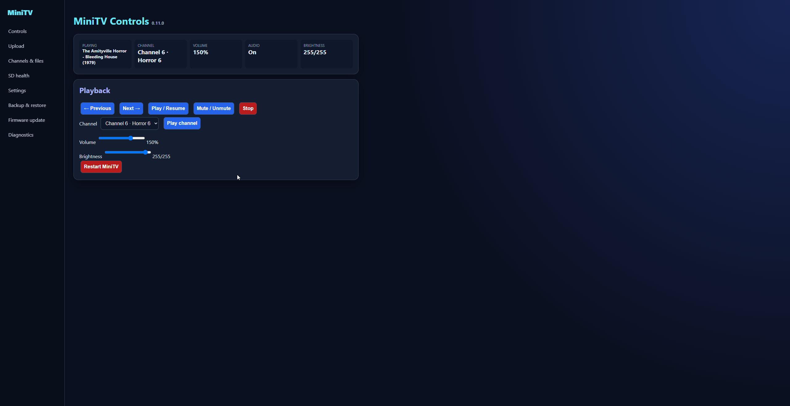
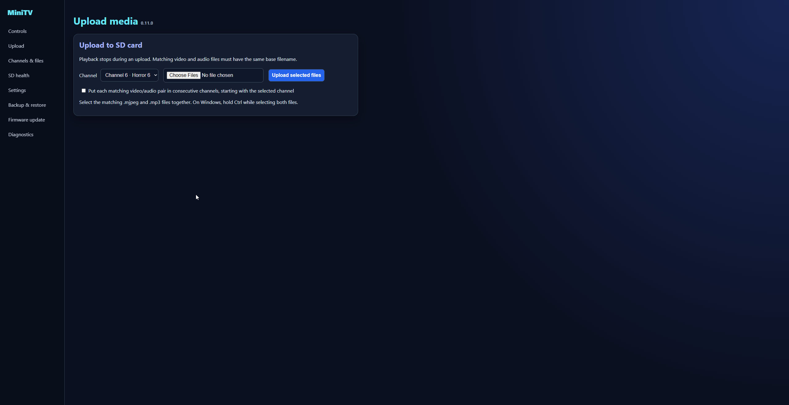
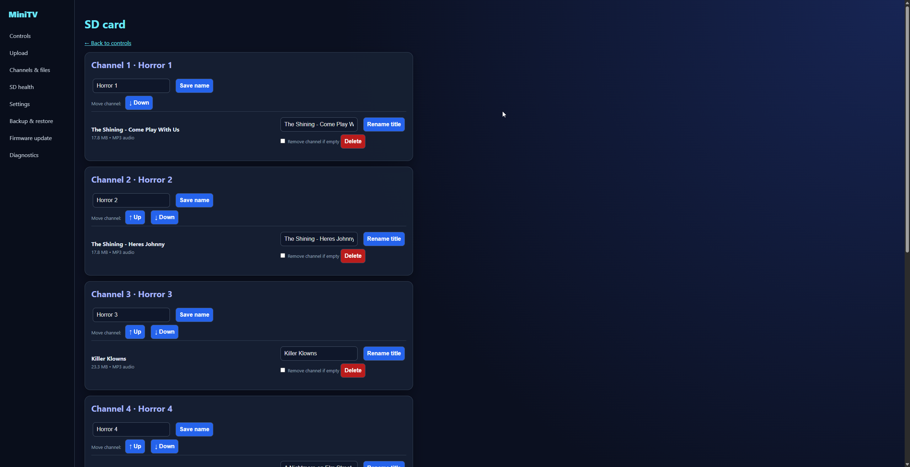
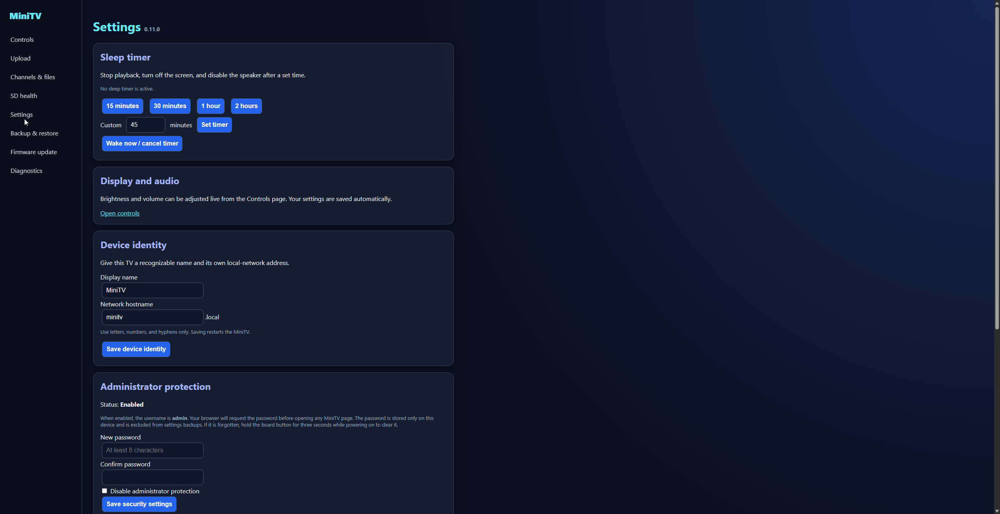

# ESP32 CYD MiniTV



A Wi-Fi-managed miniature television for the ESP32 Cheap Yellow Display (CYD). It plays 320×240 MJPEG video with MP3 audio from a microSD card and provides a responsive browser interface for playback, channels, uploads, settings, diagnostics, and over-the-air firmware updates.

Version **1.0.0** is the first stable release of this Wi-Fi edition.

> This project builds on [DynaMight1124/ESP32-MiniTV-Player](https://github.com/DynaMight1124/ESP32-MiniTV-Player), which in turn builds on the Mini Lego TV / Mini Retro TV work by Eric N. (ThatProject) and moononournation. See [Credits and project history](docs/CREDITS.md) for the full attribution chain.

## Highlights

- Plays one video/audio pair per numbered channel
- Optional random channel with multiple matched media pairs
- Web controls for channel, mute, volume, brightness, restart, and sleep
- Reliable chunked uploads with progress, retries, cancellation, and free-space checks
- Create, rename, reorder, and delete channels and matching media pairs
- First-run Wi-Fi setup portal plus editable network and hostname settings
- Optional administrator password protection
- OTA firmware updates from an exported Arduino `.bin`
- Settings backup and restore
- SD-card health scan, cleanup tools, event log, and downloadable diagnostics
- Remembers channel, volume, brightness, mute state, and settings across restarts
- Physical one-button controls remain available without the web interface

## Web interface

The responsive local dashboard separates playback and maintenance tools with a consistent sidebar. These screenshots were captured from the final 0.11.0 development build; the interface is unchanged in version 1.0.0.

### Playback controls

Control playback, select channels, and adjust volume and brightness in real time.



### Upload media

Upload matching `.mjpeg` and `.mp3` files together, with channel selection and progress reporting.



### Channels and files

Rename channels and titles, reorder channels, and delete matching media pairs.



### Settings

Configure sleep timers, device identity, administrator protection, Wi-Fi, and scheduling.



## Supported hardware

The included profiles support:

- **CYD / ESP32-2432S028** with ILI9341 display, microSD slot, onboard amplifier, and DAC audio on GPIO 26
- **CYD RetroTV variant** with alternate button/display settings
- **Original Mini TV hardware** using a 288×240 ST7789 display and external I2S audio

The tested target for this release is the classic ESP32-2432S028 CYD shown above. ESP32-S3 and other CYD variants may use different pins or display controllers and are not drop-in compatible.

## What you need

- ESP32-2432S028 CYD or another supported profile
- FAT32-formatted microSD card
- 8-ohm miniature speaker connected to the board's `SPEAKER` socket
- Arduino IDE 2.x
- ESP32 boards package **2.0.17**
- [Arduino_GFX](https://github.com/moononournation/Arduino_GFX) **1.6.0**
- [JPEGDEC](https://github.com/bitbank2/JPEGDEC)
- [arduino-libhelix](https://github.com/pschatzmann/arduino-libhelix)

The firmware uses APIs from ESP32 core 2.0.17. Newer 3.x cores require compatibility changes and are not recommended for this release.

## Install with Arduino IDE

1. Download or clone this repository.
2. Open `MiniTV/MiniTV.ino` in Arduino IDE. Keep every source file inside the `MiniTV` folder.
3. Install the libraries listed above using Library Manager or their GitHub releases.
4. Install ESP32 boards package 2.0.17.
5. In `MiniTV/config.h`, enable exactly one hardware profile. The standard CYD profile is enabled by default.
6. Select **ESP32 Dev Module** as the board.
7. Select a partition scheme with enough application space for OTA updates (for example, a compatible OTA scheme rather than a no-OTA scheme).
8. Compile and upload over USB.

Wi-Fi credentials do not need to be compiled into the sketch. Leave `WIFI_SSID` and `WIFI_PASSWORD` as `CHANGE_ME` to use the first-run setup portal.

## First-run Wi-Fi setup

When no saved network is available, the TV starts its own setup access point and shows its connection details on screen.

1. Connect your phone or computer to the MiniTV setup network shown on the display.
2. Open `http://192.168.4.1`.
3. Select your local **2.4 GHz** Wi-Fi network and enter its password.
4. After restart, open `http://minitv.local` or the IP address printed in Serial Monitor.

Classic ESP32 boards support 2.4 GHz Wi-Fi only. More detail is available in [MiniTV/WIFI_SETUP.txt](MiniTV/WIFI_SETUP.txt).

## Prepare the SD card

Format the card as FAT32 and create this structure:

```text
Videos/
├── 1/
│   ├── My Show.mjpeg
│   └── My Show.mp3
├── 2/
│   ├── Another Show.mjpeg
│   └── Another Show.mp3
└── random/
    ├── Clip One.mjpeg
    ├── Clip One.mp3
    ├── Clip Two.mjpeg
    └── Clip Two.mp3
```

Each numbered channel is intended to contain one `.mjpeg` file and one matching `.mp3` file with the same base name. The `random` folder may contain multiple matching pairs. MP3 is strongly recommended while Wi-Fi is enabled because AAC/SBR consumes substantially more memory.

### Recommended encoding

For a standard CYD, use 320×240 at 24 FPS:

```bash
ffmpeg -i input.mp4 -an -pix_fmt yuvj420p -q:v 8 -vf "fps=24,scale=320:240:flags=lanczos" output.mjpeg
ffmpeg -i input.mp4 -vn -ar 44100 -ac 1 -b:a 24k -filter:a "volume=-8dB" output.mp3
```

The two output files must have identical base names. A GUI converter is also available from [DynaMight1124/MiniTV-Video-Converter](https://github.com/DynaMight1124/MiniTV-Video-Converter).

## Controls

### Browser

The sidebar separates Controls, Upload, Channels & files, SD health, Settings, Backup & restore, Firmware update, and Diagnostics. Volume and brightness sliders apply immediately.

### Physical button

On the standard CYD, the rear BOOT button is used:

- Single click: next channel
- Double click: previous channel
- Hold 1–3 seconds: mute/unmute
- Hold 3+ seconds: launcher/reset action configured for the active profile

## OTA updates

After the first USB installation, export a compiled binary from Arduino IDE and upload it from **Firmware update** in the web interface. The TV validates the image, installs it, and restarts. Keep a USB recovery path available when testing custom builds.

## Troubleshooting

- **No audio:** Verify an 8-ohm speaker is connected to `SPEAKER`, the standard CYD profile is selected, GPIO 4 controls the active-low amplifier enable, and GPIO 26 is the DAC output.
- **Corrupted picture or wrong colors:** Confirm the correct CYD profile and display inversion setting, then re-encode at exactly 320×240, 24 FPS.
- **Wi-Fi disappears during playback:** Use MP3, ESP32 core 2.0.17, and a stable 5 V supply. Avoid AAC/SBR on the Wi-Fi build.
- **Large upload stalls:** Use the built-in Upload page, allow playback to stop, and keep the browser open. The uploader sends verified chunks and retries transient SD writes.
- **The device is unreachable:** Check Serial Monitor for its current IP, confirm the client is on the same 2.4 GHz LAN, or reset saved Wi-Fi settings using the documented recovery procedure.
- **No videos are present:** The web interface and setup functions remain available; upload or add a valid media pair to the SD card.

Downloadable diagnostics and the SD health page should be the first stop when reporting a problem.

## Security note

The web interface is designed for a trusted local network and uses HTTP. Enable the administrator password in Settings, but do not expose the device directly to the public internet.

## Contributing

Bug reports and improvements are welcome. Please read [CONTRIBUTING.md](CONTRIBUTING.md) before opening a pull request and include the firmware version, board profile, ESP32 core version, and a diagnostic report with sensitive network details removed.

## License and credits

The code is released under [The Unlicense](LICENSE), matching the inherited project. Full upstream attribution and the history of this edition are recorded in [docs/CREDITS.md](docs/CREDITS.md).
